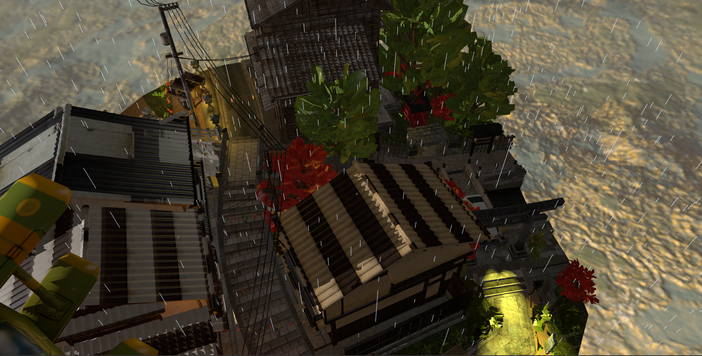

# OpenGL Japan 3D Scene

A computer graphics project implementing a complex 3D environment inspired by rural Japanese aesthetics. The project utilizes modern OpenGL (Core Profile) to demonstrate advanced rendering techniques, physics-based collisions, and dynamic weather systems.

*(Note: Replace the path above with your main screenshot path)*

## Features

### Advanced Lighting & Shadows
* **Blinn-Phong Lighting Model:** Implemented in World Space for accurate specular highlights.
* **Shadow Mapping:** Two-pass rendering algorithm with PCF (Percentage-Closer Filtering) and bias correction to eliminate shadow acne.
* **Multiple Light Sources:**
    * **Directional Light:** Dynamic sun/moon cycle.
    * **Point Lights:** Street lamps with quadratic attenuation.
    * **Spotlights:** Functional car headlights (AE86) with soft edges.

### Weather & Atmosphere
* **Volumetric Fog:** Exponential squared fog that dynamically adapts color based on the day/night cycle.
* **Particle System (Rain):** Efficient rain simulation using position recycling logic.
* **Particle System (Bonfire):** Additive blending fire effect with turbulence and convective rise simulation.

### Physics & Interaction
* **AABB Collision Detection:** Axis-Aligned Bounding Box system preventing the camera from passing through objects (walls, car, lamps).
* **Camera System:** First-Person Shooter (FPS) camera with pitch/yaw rotation and strafe movement.
* **Cinematic Intro:** Smooth "Fly-in" camera animation sequence upon startup.

### Technical Details
* **Procedural Generation:** Street lights and collision boxes are generated algorithmically along the road path.
* **Shaders:** Custom GLSL vertex and fragment shaders.
* **Gamma Correction:** sRGB framebuffer enabled for realistic color output.

## Controls

| Key | Action |
| :--- | :--- |
| **W, A, S, D** | Move Camera |
| **Mouse** | Look around |
| **N** | Toggle Day / Night Cycle |
| **F** | Toggle Fog |
| **R** | Toggle Rain |
| **J** | Toggle Sun Animation |
| **Z** | Cycle View Modes (Solid, Wireframe, Points) |
| **ESC** | Exit Application |

## Built With
* **C++**
* **OpenGL 4.1** (Core Profile)
* **GLFW** & **GLEW** - Window and context management.
* **GLM** - Mathematics library.
* **TinyObjLoader** - Model loading.

## Project Structure
* `src/` - C++ Source code (main.cpp, Camera, Model3D, etc.).
* `shaders/` - GLSL Shader files (.vert, .frag).
* `objects/` - 3D Models (.obj, .mtl).
* `textures/` - Image textures.
* `skybox/` - Cubemap textures.

## Credits & Assets
Special thanks to the creators of the 3D models used in this project:

* **Japanese City Scene:** [Tanabata Evening (Kyoto Inspired)](https://sketchfab.com/3d-models/tanabata-evening-kyoto-inspired-city-scene-04dc9402b74d43ef86c4795311c0e4bb)
* **Toyota AE86:** [Toyota AE86 Model](https://sketchfab.com/3d-models/toyota-ae86-da84f6e22f20486a91b7a012556d80f6)
* **Bonfire:** [Dark Souls Bonfire](https://sketchfab.com/3d-models/dark-souls-bonfire-b0d68c8f4cd0487da3d1fb8327ab1044)
* **Street Lamp:** [Japanese Street Lamp](https://sketchfab.com/3d-models/japanese-street-lamp-de9e13e35b504fea84b51857adb2e8b0)
* **Airplane:** [Spitfire Stylised Design](https://sketchfab.com/3d-models/spitfire-airplane-stylised-design-2cdeb622ea4b4d3caa3729774bc013a5)
* **Character Model:** [Naked Snake Photogrammetry](https://sketchfab.com/3d-models/naked-snake-photogrammetry-8067da6fe16848688f452ac8ac9011e2)

